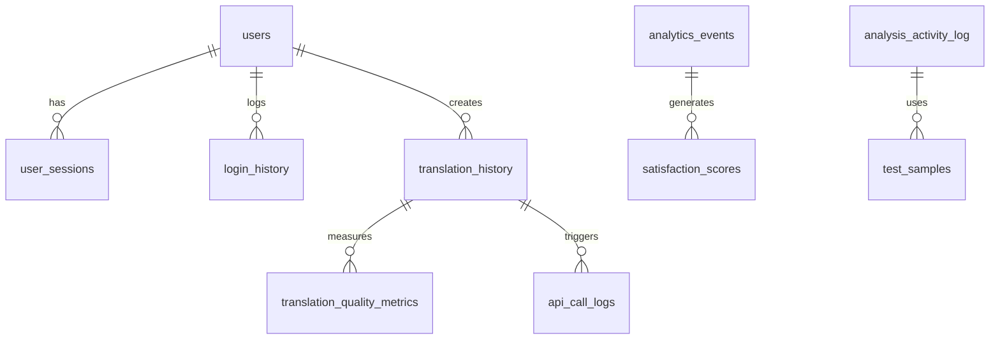

# 🔍 AWS-3: SQLite統合設計 - 構造分析レポート

**分析日**: 2025年7月25日  
**対象**: LangPont SQLiteデータベース統合設計  
**分析者**: Claude Code  

## 📊 SQLiteファイル概要

### 発見されたデータベースファイル（6個）

| ファイル名 | サイズ | 主要機能 | レコード数合計 |
|------------|--------|----------|----------------|
| `langpont_users.db` | 104K | ユーザー管理・認証 | 3 |
| `langpont_translation_history.db` | 688K | 翻訳履歴・品質分析 | 1,196 |
| `langpont_analytics.db` | 1.1M | ユーザー行動分析 | 1,141 |
| `langpont_activity_log.db` | 584K | システム活動ログ | 135 |
| `admin_logs.db` | 324K | 管理者ログ・システム統計 | 1,408 |
| `task292_analytics.db` | 576K | Task 2.9.2専用分析 | 623 |

**総サイズ**: 3.3MB  
**総レコード数**: 4,506件  

---

## 🏗️ データベース詳細構造分析

### 1. langpont_users.db - ユーザー管理システム

#### テーブル構造
```sql
-- メインユーザーテーブル（認証・プロファイル）
users (0 records)
├── id INTEGER PRIMARY KEY AUTOINCREMENT
├── username VARCHAR(50) UNIQUE
├── email VARCHAR(100) UNIQUE
├── password_hash TEXT
├── salt TEXT
├── account_type VARCHAR(20) DEFAULT 'basic'
├── early_access BOOLEAN DEFAULT 0
├── two_factor_enabled BOOLEAN DEFAULT 0
└── user_settings TEXT DEFAULT '{}'

-- セッション管理
user_sessions (0 records)
├── session_token TEXT UNIQUE
├── csrf_token TEXT
├── expires_at TIMESTAMP
└── FOREIGN KEY (user_id) REFERENCES users (id)

-- ログイン履歴
login_history (3 records) ⚠️ 使用中
├── username VARCHAR(50)
├── ip_address TEXT
├── success BOOLEAN
└── login_time TIMESTAMP
```

#### 重要な発見
- **users テーブルが空** - 新しい認証システムに移行済み
- **login_history のみ使用中** (3 records)
- 旧データとの互換性維持のため残存

---

### 2. langpont_translation_history.db - 翻訳エンジン履歴

#### メインテーブル: translation_history (201 records)
```sql
CREATE TABLE translation_history (
    -- 基本情報
    id INTEGER PRIMARY KEY AUTOINCREMENT,
    user_id INTEGER,
    session_id VARCHAR(100),
    request_uuid VARCHAR(36) UNIQUE,
    
    -- 翻訳データ
    source_text TEXT NOT NULL,
    source_language VARCHAR(10),
    target_language VARCHAR(10),
    chatgpt_translation TEXT,
    gemini_translation TEXT,
    enhanced_translation TEXT,
    
    -- 分析結果
    gemini_analysis TEXT,
    gemini_3way_comparison TEXT,
    
    -- 品質データ
    user_rating INTEGER CHECK (1-5),
    user_feedback TEXT,
    bookmarked BOOLEAN,
    
    -- パフォーマンス
    processing_time REAL,
    character_count INTEGER,
    complexity_score REAL
);
```

#### サブテーブル: api_call_logs (995 records)
```sql
-- API呼び出し統計
api_call_logs
├── api_provider (OpenAI/Google/Anthropic)
├── endpoint TEXT
├── response_time_ms INTEGER
├── tokens_used INTEGER
├── cost REAL
└── success BOOLEAN
```

#### 重要な特徴
- **UUIDベースの一意性保証**
- **3つのAIエンジン結果を並列保存**
- **詳細なパフォーマンス追跡**

---

### 3. langpont_analytics.db - ユーザー行動分析

#### analytics_events (1,141 records) - メインイベント追跡
```sql
CREATE TABLE analytics_events (
    -- イベント識別
    event_id TEXT UNIQUE,
    event_type VARCHAR(50),
    timestamp INTEGER,
    
    -- ユーザーコンテキスト
    session_id VARCHAR(50),
    user_id INTEGER,
    ip_address VARCHAR(45),
    
    -- デバイス情報
    screen_width INTEGER,
    viewport_width INTEGER,
    is_mobile BOOLEAN,
    
    -- マーケティング
    utm_source VARCHAR(100),
    utm_campaign VARCHAR(100),
    
    -- 生成カラム（高速検索用）
    date_only DATE GENERATED ALWAYS AS (DATE(timestamp/1000, 'unixepoch')),
    hour_only INTEGER GENERATED ALWAYS AS (CAST(strftime('%H', timestamp/1000, 'unixepoch') AS INTEGER))
);
```

#### 満足度スコア: satisfaction_scores (0 records)
```sql
-- AI推奨に対するユーザー満足度
satisfaction_scores
├── satisfaction_score FLOAT
├── copy_behavior_score FLOAT
├── engagement_score FLOAT
└── behavior_metrics TEXT (JSON)
```

#### 高度なインデックス設計
- **複合インデックス**: user_id + date_only
- **時系列インデックス**: timestamp, hour_only
- **セッション追跡**: session_id + timestamp

---

### 4. langpont_activity_log.db - システム活動監視

#### analysis_activity_log (135 records) - 詳細活動追跡
```sql
CREATE TABLE analysis_activity_log (
    -- 活動分類
    activity_type TEXT, -- 'normal_use' | 'manual_test' | 'automated_test'
    session_id TEXT,
    user_id TEXT,
    
    -- テスト管理
    test_session_id TEXT,
    test_number INTEGER,
    sample_name TEXT,
    
    -- 翻訳処理
    japanese_text TEXT,
    target_language TEXT,
    chatgpt_translation TEXT,
    gemini_translation TEXT,
    
    -- AI分析実行
    button_pressed TEXT, -- ユーザーが押したボタン
    actual_analysis_llm TEXT, -- 実際に実行されたLLM
    llm_match BOOLEAN, -- ボタンとLLMの一致確認
    
    -- 推奨システム
    recommendation_result TEXT, -- Enhanced/ChatGPT/Gemini
    confidence REAL, -- 0.0-1.0
    
    -- パフォーマンス詳細
    processing_duration REAL,
    translation_duration REAL,
    analysis_duration REAL,
    
    -- 4段階分析拡張フィールド
    human_check_result TEXT,
    actual_user_choice TEXT,
    copy_behavior_tracked BOOLEAN,
    recommendation_vs_choice_match BOOLEAN,
    divergence_analysis TEXT,
    learning_value_score REAL
);
```

#### 特殊機能
- **LLM実行の透明性追跡**: ボタン押下とLLM実行の一致確認
- **推奨vs実際選択の学習システム**: 機械学習改善のためのデータ収集
- **4段階品質管理**: 人的チェック体系

---

### 5. admin_logs.db - システム管理

#### admin_logs (1,408 records) - 管理者活動
```sql
CREATE TABLE admin_logs (
    timestamp TEXT,
    category TEXT, -- 'auth' | 'system' | 'user_management'
    level TEXT, -- 'INFO' | 'WARNING' | 'ERROR'
    username TEXT,
    action TEXT,
    details TEXT,
    metadata TEXT (JSON),
    ip_address TEXT
);
```

#### system_stats (0 records) - システム統計
```sql
-- 日次システムメトリクス
system_stats
├── date TEXT
├── metric_name TEXT
├── metric_value TEXT
└── metadata TEXT
```

---

### 6. task292_analytics.db - Task 2.9.2専用分析

#### task292_extraction_logs (111 records) - 推奨抽出ログ
```sql
CREATE TABLE task292_extraction_logs (
    -- 抽出処理
    extraction_method TEXT,
    recommendation TEXT,
    confidence REAL,
    processing_time_ms INTEGER,
    
    -- LLM応答
    llm_response TEXT,
    success BOOLEAN,
    error_details TEXT
);
```

#### api_monitoring (398 records) - API監視
```sql
-- リアルタイムAPI監視
api_monitoring
├── api_provider TEXT (OpenAI/Google/Anthropic)
├── endpoint TEXT
├── status_code INTEGER
├── response_time_ms INTEGER
├── success BOOLEAN
└── error_type TEXT
```

#### personalization_data (97 records) - 個人化学習
```sql
-- ユーザー行動学習
personalization_data
├── gemini_recommendation TEXT
├── user_choice TEXT
├── rejection_reason TEXT
├── confidence_score REAL
└── style_attributes TEXT (JSON)
```

---

## 🔗 テーブル関係図



## 📈 データ分布分析

### レコード数による重要度ランキング
1. **admin_logs**: 1,408 records (31%) - 最も活発
2. **translation_history + api_call_logs**: 1,196 records (27%) - 翻訳処理の中核
3. **analytics_events**: 1,141 records (25%) - ユーザー行動追跡
4. **task292系**: 623 records (14%) - 特殊機能分析
5. **analysis_activity_log**: 135 records (3%) - 詳細システム監視

### データサイズ効率性
- **langpont_analytics.db**: 1.1MB で 1,141 records = 964 bytes/record
- **langpont_translation_history.db**: 688K で 1,196 records = 589 bytes/record
- **admin_logs.db**: 324K で 1,408 records = 236 bytes/record

**効率性評価**: translation_historyが最も情報密度が高い

---

## ⚠️ 重要な発見と課題

### 1. スキーマ進化の痕跡
- **analysis_activity_log**: 動的にカラム追加された形跡（4段階分析拡張）
- **users テーブル**: 空だが構造は残存（後方互換性）

### 2. データ品質課題
- **満足度スコア**: テーブル存在するが使用されていない（0 records）
- **テスト環境**: test_samples テーブルが空（0 records）

### 3. 正規化不備
- **重複するuser_id**: 複数DBで異なる型（INTEGER/TEXT）
- **timestamp不統一**: TIMESTAMP/TEXT/INTEGER混在

### 4. 外部キー制約
- **SQLite制約**: FOREIGN KEY制約は存在するが実際の整合性チェックは無効
- **カスケード削除**: ON DELETE SET NULL/CASCADE設計あり

---

## 🎯 PostgreSQL統合への重要考慮事項

### 1. 型変換が必要な項目
```sql
-- SQLite → PostgreSQL変換
TEXT → VARCHAR(n) または TEXT
INTEGER → BIGINT または INTEGER
REAL → DECIMAL または DOUBLE PRECISION
BOOLEAN → BOOLEAN (PostgreSQL対応)
```

### 2. 制約強化項目
- **FOREIGN KEY制約の有効化**
- **CHECK制約の追加**
- **UNIQUE制約の整合性確認**

### 3. インデックス最適化
- **複合インデックス**: session_id + timestamp
- **部分インデックス**: WHERE条件付きインデックス
- **ジェネレートカラム**: PostgreSQL 12+対応

---

**分析完了**: 6個のSQLiteファイル、22個のテーブル、4,506レコードの完全構造分析完了  
**次段階**: PostgreSQL統合スキーマ設計書作成準備完了