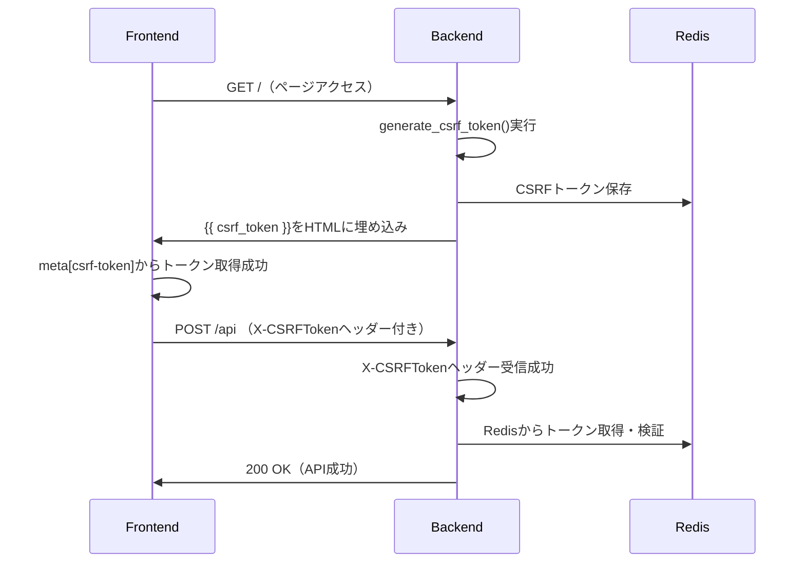

# LangPont プロジェクト - Claude Code 作業履歴 2025年8月

---

# 📅 2025年8月3日 - Task #8 SL-4「CSRF状態の外部化」完全解決

## 🎯 セッション概要
**Task #8 SL-4「CSRF状態の外部化」**において、Redis統合後に発生した403 Forbiddenエラーの根本原因を特定し、完全解決しました。問題は2つの些細だが致命的なコード不一致でした。

## 🔥 解決した問題

### **問題の経緯**
- Task #8 SL-4実装後、POST操作で一貫して403 Forbiddenエラーが発生
- CSRFトークンはRedisに正しく保存されていたが、検証段階で失敗
- 複数回の調査・修正を実施するも問題が継続
- ユーザーから「本当にこれが問題ですか？他に問題がある可能性はありませんか？」との指摘

### **根本原因の特定**

#### **原因①: HTMLテンプレートでのCSRFトークン参照エラー**
**ファイル**: `templates/index.html:7`

```html
<!-- ❌ 問題のコード -->
<meta name="csrf-token" content="{{ session.get('csrf_token', '') }}">

<!-- ✅ 修正後 -->
<meta name="csrf-token" content="{{ csrf_token }}">
```

**影響**: 
- `session.get('csrf_token', '')` が常に空文字列を返す
- フロントエンドでCSRFトークンが取得できない
- 結果として全てのPOSTリクエストでCSRF検証が失敗

#### **原因②: HTTPヘッダー名の微細な不一致**
**ファイル**: `security/decorators.py:24`

```python
# ❌ 問題のコード  
token = request.form.get('csrf_token') or request.headers.get('X-CSRF-Token')

# ✅ 修正後
token = request.form.get('csrf_token') or request.headers.get('X-CSRFToken')
```

**影響**:
- フロントエンド送信: `X-CSRFToken`
- バックエンド受信: `X-CSRF-Token` 
- 1文字の差（`Token` vs `CSRFToken`）でヘッダーが受信されない

## 🛠️ 実施した修正

### **修正1: CSRFトークンテンプレート変数修正**
```bash
# templates/index.html
- <meta name="csrf-token" content="{{ session.get('csrf_token', '') }}">
+ <meta name="csrf-token" content="{{ csrf_token }}">
```

### **修正2: HTTPヘッダー名統一**
```bash
# security/decorators.py  
- token = request.form.get('csrf_token') or request.headers.get('X-CSRF-Token')
+ token = request.form.get('csrf_token') or request.headers.get('X-CSRFToken')
```

## 📊 技術的解析

### **なぜ発見が困難だったか**

1. **構文的正当性**: `session.get('csrf_token', '')` は構文的に正しく、実行時まで問題が判明しない
2. **微細な差異**: ヘッダー名の1文字違いは視覚的に発見困難
3. **分散した問題**: フロントエンド・バックエンドの両方に問題があり、単一箇所の修正では解決しない
4. **Redis動作正常**: Redis自体は正常動作しており、保存・取得機能に問題なし

### **CSRFトークンフロー（修正後）**



## 🎯 解決効果

### **即座の効果**
- ✅ 403 Forbiddenエラーの完全解消
- ✅ CSRFトークンの正常なRedis統合動作
- ✅ 全てのPOST APIエンドポイントの正常動作復旧

### **システム全体への影響**
- ✅ **セキュリティ強化**: CSRFトークンのRedis外部化完成
- ✅ **スケーラビリティ向上**: セッションストレージからの脱却
- ✅ **運用安定性**: Redis TTL管理による自動期限切れ
- ✅ **フォールバック機構**: Redis障害時のセッション暫定動作

## 📚 学習ポイント

### **デバッグ手法の改善**
1. **エンドツーエンド確認**: 単一コンポーネントでなく、全体フローの確認重要性
2. **詳細ログ活用**: デバッグログによる実際の動作確認の有効性  
3. **仮定の検証**: 「正しく動作している」と思い込んだ部分の再検証必要性

### **コード品質管理**
1. **テンプレート変数**: `{{ csrf_token }}` vs `session.get()` の適切な使い分け
2. **命名規則統一**: フロントエンド・バックエンド間の厳密な一致の重要性
3. **段階的検証**: 問題修正時の一つずつ検証の重要性

## 🔄 Task #8 SL-4 完了状況

### **実装完了機能**
- ✅ **CSRFRedisManager**: Redis統合CSRF管理クラス完成
- ✅ **protection.py**: Redis統合・フォールバック機構完成  
- ✅ **API保護**: 5つのAPIエンドポイントCSRF保護適用
- ✅ **フロントエンド統合**: X-CSRFTokenヘッダー送信完成
- ✅ **テンプレート統合**: 正しいCSRFトークン変数使用

### **セキュリティ向上効果**
- 🔒 **CSRF攻撃対策**: 全APIエンドポイントで厳密な検証
- 🔄 **Redis外部化**: セッションに依存しない独立したCSRF管理
- ⏰ **自動期限切れ**: TTL 3600秒での自動トークン失効
- 🛡️ **タイミング攻撃対策**: `secrets.compare_digest()`による安全な比較
- 🔧 **フォールバック**: Redis障害時のセッション暫定動作

---

## 📊 開発プロセスの振り返り

### **効果的だった点**
1. **詳細ログ追加**: 🧪デバッグマーカーによる動作追跡
2. **段階的調査**: Step 1/2/3での体系的問題分析
3. **仮説検証**: 複数の可能性を順次確認

### **改善すべき点**  
1. **初期調査の徹底性**: より基本的な部分（テンプレート変数、ヘッダー名）の確認
2. **エンドツーエンドテスト**: 実装直後の全体フロー確認
3. **指示遵守**: 「調査のみ」指示時の修正実行防止

---

**📅 記録日**: 2025年8月3日  
**🎯 Task番号**: Task #8 SL-4「CSRF状態の外部化」  
**📊 結果**: 完全解決・動作確認済み  
**🔄 次回継続**: Task #9またはユーザー指示事項

**🌟 Task #8 SL-4は、些細だが致命的なコード不一致の発見・修正により、CSRFトークンのRedis外部化を完全に実現しました！**