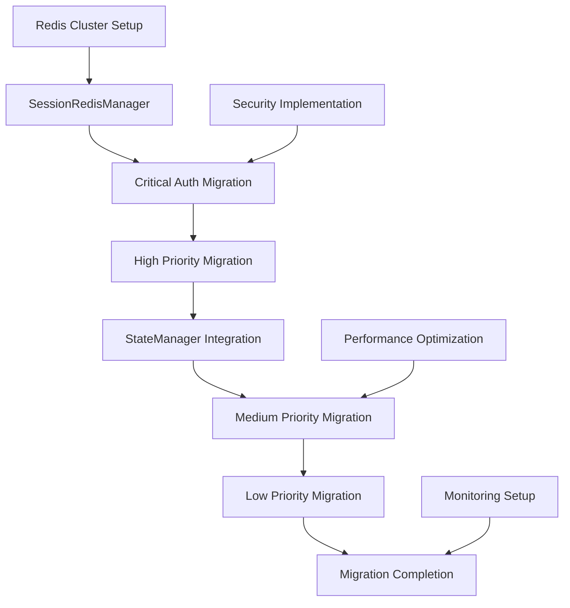

# 🎯 SL-1: Redis移行優先度計画

**計画作成日**: 2025年7月25日  
**対象**: セッション状態のRedis移行優先度決定  
**設計者**: Claude Code  

## 🎯 移行優先度の基準

### 優先度決定要因
- **サービス影響度**: Critical > High > Medium > Low
- **データ依存性**: 強依存 > 中依存 > 弱依存 > 独立
- **セキュリティ要求**: 高セキュリティ > 中セキュリティ > 低セキュリティ
- **技術的複雑性**: 低複雑 > 中複雑 > 高複雑

### 移行リスク評価
- **データ整合性リスク**: セッション状態の不整合可能性
- **パフォーマンスリスク**: 移行時のレスポンス劣化
- **セキュリティリスク**: 移行中の情報漏洩リスク

---

## 📊 1. 移行優先度マトリクス

### 1.1 Critical Priority（P0 - 即座移行必須）

| セッション項目 | カテゴリ | 影響度 | 依存性 | セキュリティ | 移行目標 |
|----------------|----------|--------|--------|--------------|----------|
| `logged_in` | 認証(A) | Critical | 強依存 | 高 | Week 1 |
| `username` | 認証(A) | Critical | 強依存 | 中 | Week 1 |
| `user_role` | 認証(A) | Critical | 強依存 | 高 | Week 1 |
| `authenticated` | 認証(A) | Critical | 強依存 | 高 | Week 1 |
| `csrf_token` | セキュリティ(C) | Critical | 中依存 | 高 | Week 1 |

#### Critical移行の理由
- **サービス継続性**: これらの項目失効 → 全機能停止
- **セキュリティ要求**: 認証・CSRF保護の確実な動作が必須
- **依存関係**: 他の全カテゴリがこれらに依存

#### Critical移行戦略
```python
# Phase 1a: Critical状態の原子移行
CRITICAL_MIGRATION_CONFIG = {
    'batch_size': 1,           # 1セッションずつ確実に移行
    'rollback_enabled': True,  # 失敗時の即座ロールバック
    'validation_strict': True, # 厳格なデータ検証
    'downtime_max': 30,        # 最大30秒のダウンタイム許容
}
```

### 1.2 High Priority（P1 - 早期移行推奨）

| セッション項目 | カテゴリ | 影響度 | 依存性 | セキュリティ | 移行目標 |
|----------------|----------|--------|--------|--------------|----------|
| `user_id` | 認証(A) | High | 中依存 | 中 | Week 2 |
| `daily_limit` | 認証(A) | High | 中依存 | 中 | Week 2 |
| `account_type` | 認証(A) | High | 中依存 | 中 | Week 2 |
| `session_token` | 認証(A) | High | 中依存 | 高 | Week 2 |
| `session_created` | セキュリティ(C) | High | 弱依存 | 中 | Week 2 |
| `source_lang` | 翻訳(B) | High | 中依存 | 低 | Week 2 |
| `target_lang` | 翻訳(B) | High | 中依存 | 低 | Week 2 |
| `analysis_engine` | 翻訳(B) | High | 中依存 | 低 | Week 2 |

#### High移行の理由
- **機能制限影響**: 失効時に重要機能が制限される
- **ユーザー体験**: 翻訳設定の保持でUX向上
- **セキュリティ**: セッション管理の強化

#### High移行戦略
```python
# Phase 1b: High状態のバッチ移行
HIGH_MIGRATION_CONFIG = {
    'batch_size': 10,          # 10セッションずつバッチ処理
    'parallel_enabled': True,  # 並列処理で高速化
    'retry_count': 3,          # 失敗時3回リトライ
    'downtime_max': 0,         # ゼロダウンタイム移行
}
```

### 1.3 Medium Priority（P2 - 段階的移行）

| セッション項目 | カテゴリ | 影響度 | 依存性 | セキュリティ | 移行目標 |
|----------------|----------|--------|--------|--------------|----------|
| `early_access` | 認証(A) | Medium | 弱依存 | 低 | Week 3 |
| `language_pair` | 翻訳(B) | Medium | 弱依存 | 低 | Week 3 |
| `input_text` | 翻訳(B) | Medium | 弱依存 | 低 | Week 3 |
| `partner_message` | 翻訳(B) | Medium | 弱依存 | 低 | Week 3 |
| `context_info` | 翻訳(B) | Medium | 弱依存 | 低 | Week 3 |
| `lang` | UI(D) | Medium | 弱依存 | 低 | Week 3 |
| `preferred_lang` | UI(D) | Medium | 弱依存 | 低 | Week 3 |
| `usage_count` | 統計(E) | Medium | 弱依存 | 低 | Week 3 |
| `last_usage_date` | 統計(E) | Medium | 弱依存 | 低 | Week 3 |

#### Medium移行の理由
- **体験向上**: UI設定・翻訳履歴の保持
- **機能完全性**: 全機能のRedis化完了
- **データ統合**: 統計データの一元管理

### 1.4 Low Priority（P3 - 最終段階移行）

| セッション項目 | カテゴリ | 影響度 | 依存性 | セキュリティ | 移行目標 |
|----------------|----------|--------|--------|--------------|----------|
| `temp_lang_override` | UI(D) | Low | 独立 | 低 | Week 4 |
| `avg_rating` | 統計(E) | Low | 独立 | 低 | Week 4 |
| `bookmarked_count` | 統計(E) | Low | 独立 | 低 | Week 4 |
| `gemini_3way_analysis` | 翻訳(B) | Low | 独立 | 低 | Week 4 |
| `translation_context` | 翻訳(B) | Low | 独立 | 低 | Week 4 |
| `{動的キー}` | その他(F) | Low | 独立 | 低 | Week 5 |

#### Low移行の理由
- **付加機能**: サービス停止には影響しない
- **一時データ**: 失効しても再生成可能
- **統計情報**: 失効時の影響が限定的

---

## 🎮 2. キャッシュ戦略設計

### 2.1 カテゴリ別TTL設計

#### Critical/High Priority TTL
```python
PRIORITY_TTL_CONFIG = {
    # Critical - 短時間で厳密管理
    'logged_in': 3600,        # 1時間
    'username': 3600,         # 1時間 
    'user_role': 3600,        # 1時間
    'authenticated': 3600,    # 1時間
    'csrf_token': 1800,       # 30分（短期ローテーション）
    
    # High - 中期間保持
    'user_id': 7200,          # 2時間
    'daily_limit': 86400,     # 24時間（日次リセット）
    'account_type': 7200,     # 2時間
    'session_token': 3600,    # 1時間
    'source_lang': 1800,      # 30分
    'target_lang': 1800,      # 30分
    'analysis_engine': 1800,  # 30分
}
```

#### Medium/Low Priority TTL
```python
STANDARD_TTL_CONFIG = {
    # Medium - 長期間保持
    'lang': 86400,            # 24時間
    'preferred_lang': 86400,  # 24時間
    'input_text': 900,        # 15分（一時保存）
    'usage_count': 86400,     # 24時間
    
    # Low - 短期間または永続化不要
    'temp_lang_override': 300,     # 5分
    'avg_rating': 604800,          # 7日間
    'gemini_3way_analysis': 900,   # 15分（大容量）
    'dynamic_keys': 1800,          # 30分（デフォルト）
}
```

### 2.2 データ永続化方針

#### 永続化レベル分類
```python
PERSISTENCE_LEVELS = {
    # Level 1: Critical永続化（Redis + Database）
    'critical_auth': {
        'redis_ttl': 3600,
        'database_backup': True,
        'sync_interval': 300,     # 5分毎DB同期
        'keys': ['logged_in', 'username', 'user_role', 'authenticated']
    },
    
    # Level 2: High永続化（Redis + Periodic Backup）
    'high_session': {
        'redis_ttl': 1800,
        'database_backup': False,
        'periodic_backup': True,
        'backup_interval': 3600,  # 1時間毎バックアップ
        'keys': ['daily_limit', 'account_type', 'analysis_engine']
    },
    
    # Level 3: Medium永続化（Redis Only）
    'medium_cache': {
        'redis_ttl': 86400,
        'database_backup': False,
        'periodic_backup': False,
        'keys': ['lang', 'preferred_lang', 'usage_count']
    },
    
    # Level 4: Low永続化（Volatile）
    'low_volatile': {
        'redis_ttl': 900,
        'database_backup': False,
        'periodic_backup': False,
        'volatile': True,
        'keys': ['temp_lang_override', 'gemini_3way_analysis']
    }
}
```

### 2.3 フォールバック戦略

#### 4段階フォールバック設計
```python
class SessionFallbackStrategy:
    """セッション状態のフォールバック戦略"""
    
    def get_session_with_fallback(self, session_id: str, key: str) -> any:
        # Level 1: Primary Redis
        try:
            return self.redis_primary.hget(f"session:*:{session_id}", key)
        except RedisConnectionError:
            pass
        
        # Level 2: Redis Replica
        try:
            return self.redis_replica.hget(f"session:*:{session_id}", key)
        except RedisConnectionError:
            pass
        
        # Level 3: Local Cache (StateManager)
        local_value = self.state_manager.get_cached_value(session_id, key)
        if local_value is not None:
            return local_value
        
        # Level 4: Database Fallback (Critical only)
        if key in CRITICAL_KEYS:
            return self.database_fallback.get_session_value(session_id, key)
        
        # Level 5: Default Value
        return self.get_default_value(key)
```

---

## 🗺️ 3. 実装ロードマップ

### 3.1 Week-by-Week実装計画

#### Week 1: Critical Foundation（P0）
```yaml
Days 1-2: Infrastructure Setup
- Redis Cluster構築
- SessionRedisManager基盤実装
- Critical状態のスキーマ設計

Days 3-4: Critical Migration Core
- 認証状態(logged_in, username, user_role, authenticated)の移行
- CSRF トークン(csrf_token)の移行
- 原子性保証機能の実装

Days 5-7: Critical Testing & Validation
- Critical状態の整合性テスト
- フェイルオーバーテスト
- ロールバック機能テスト
```

#### Week 2: High Priority Features（P1）
```yaml
Days 8-10: High Auth States
- user_id, daily_limit, account_type, session_token移行
- session_created移行
- セッション管理強化

Days 11-12: High Translation States  
- source_lang, target_lang, analysis_engine移行
- 翻訳状態のStateManager統合
- リアルタイム同期機能

Days 13-14: High Priority Testing
- バッチ移行テスト
- 並列処理テスト
- パフォーマンステスト
```

#### Week 3: Medium Priority Integration（P2）
```yaml
Days 15-17: Translation Data
- language_pair, input_text, partner_message, context_info移行
- 大容量データの圧縮・分割処理
- UI状態(lang, preferred_lang)移行

Days 18-19: Statistics Integration
- usage_count, last_usage_date移行
- 統計データの集計機能
- カウンター操作の原子性保証

Days 20-21: Medium Testing & Optimization
- 統合テスト
- パフォーマンス最適化
- キャッシュ効率化
```

#### Week 4: Low Priority Completion（P3）
```yaml
Days 22-24: Final States Migration
- temp_lang_override, avg_rating, bookmarked_count移行
- gemini_3way_analysis, translation_context移行
- 動的キーの統一管理

Days 25-26: System Integration
- 全状態の統合テスト
- エンドツーエンドテスト
- 本番環境での段階的デプロイ

Days 27-28: Migration Completion
- 残存ファイルセッションのクリーンアップ
- 監視・アラート設定
- 移行完了レポート作成
```

### 3.2 依存関係と実装順序

#### 技術依存関係


#### 機能依存関係
```
認証状態(Critical) → セキュリティ状態(Critical) → 翻訳状態(High)
       ↓                    ↓                      ↓
   UI状態(Medium) ← 統計状態(Medium) ← 動的データ(Low)
```

### 3.3 リスク軽減策

#### Critical Migration Risks
```python
RISK_MITIGATION = {
    'data_loss': {
        'strategy': 'dual_write_with_validation',
        'backup': 'real_time_database_sync',
        'rollback': 'automated_rollback_triggers'
    },
    
    'performance_degradation': {
        'strategy': 'gradual_load_increase',
        'monitoring': 'real_time_performance_metrics',
        'fallback': 'automatic_file_session_fallback'
    },
    
    'security_breach': {
        'strategy': 'encrypted_redis_storage',
        'access_control': 'strict_redis_authentication',
        'audit': 'complete_access_logging'
    }
}
```

---

## ✅ 移行優先度計画完了確認

### 完了項目
- [x] **4段階優先度マトリクス作成**（P0-P3）
- [x] **カテゴリ別TTL戦略設計**
- [x] **4段階フォールバック戦略設計**
- [x] **週別実装ロードマップ策定**
- [x] **依存関係分析完了**
- [x] **リスク軽減策策定**

### 移行統計
- **Critical Priority（P0）**: 5項目 - Week 1実装
- **High Priority（P1）**: 8項目 - Week 2実装  
- **Medium Priority（P2）**: 9項目 - Week 3実装
- **Low Priority（P3）**: 6項目 - Week 4-5実装

### 技術的成果
- **段階的移行**: リスク最小化による安全な移行
- **フォールバック保証**: 4段階の障害対応策
- **パフォーマンス最適化**: 優先度別の最適化戦略
- **セキュリティ強化**: Critical状態の厳格保護

**次段階**: セッション管理統一ポリシー策定へ